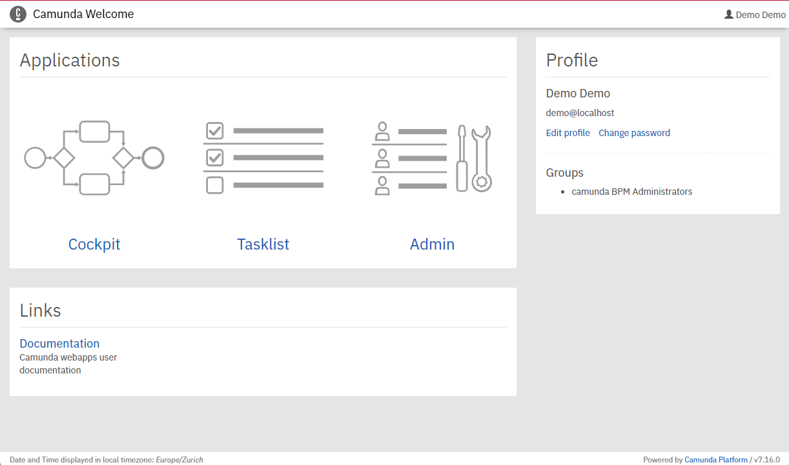
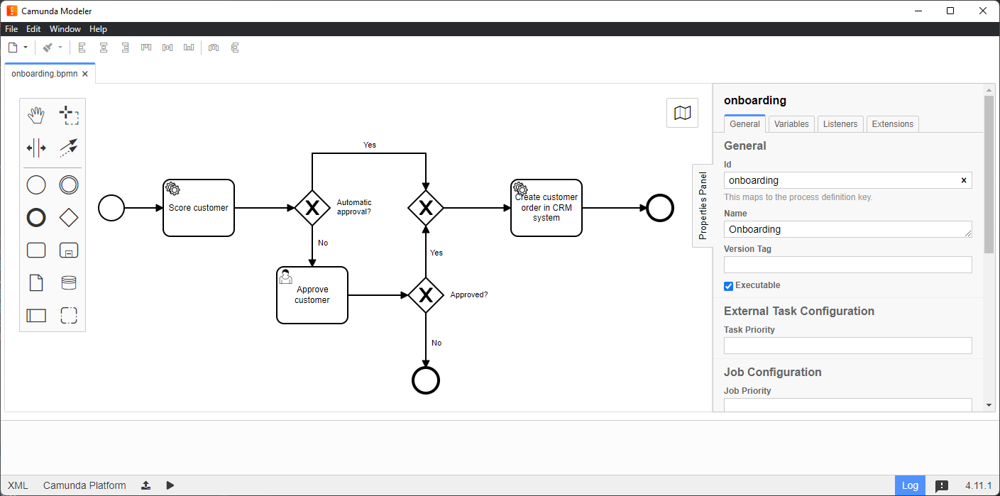
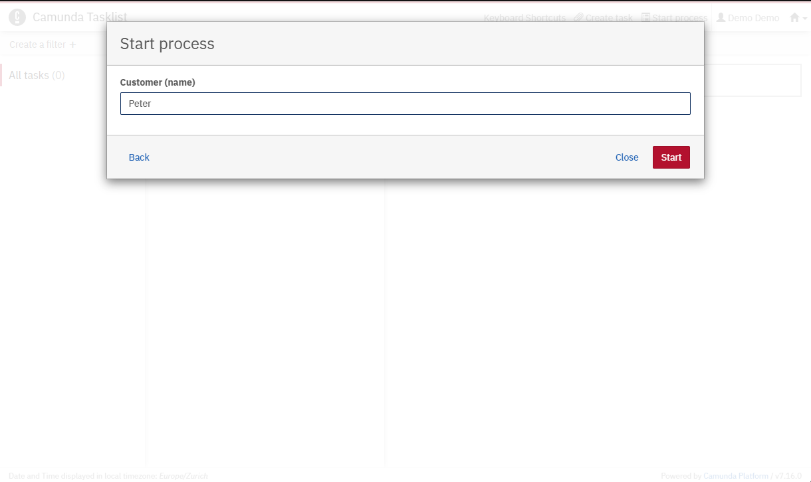

# lab05-customer-onboarding-camunda

This project illustrates how to use a process engine, namely the Camunda BPM Platform, programmatically within a Spring Boot application.

## Process Solution

The main process solution is the [process-solution-java](/process-solution-java) SpringBoot application.

The [pom file](/process-solution-java/pom.xml) specifies the corresponding dependencies for the Camunda Spring Boot project.

Running the main [Application](/process-solution-java/src/main/java/com/example/processsolutionjava/CustomerOnboardingCamundaApplication.java) starts
the SpringBoot application with an embedded version of the Camunda BPM platform locally on your computer. You can access its [user interface](http://localhost:8080/) via your web browser.
Use the credentials: *demo* / *demo* to login. After login you see the following overview:

### Modeling and Deploying Processes

To model processes in BPMN 2.0 we recommend using the [Camunda Modeler](https://camunda.com/de/download/modeler/) desktop application. The following is a screenshot
of the [onboarding](/process-solution-java/src/main/resources/onboarding.bpmn) process provided with this project opened in the Modeler. 

All *bpmn* files within
the [resources](/process-solution-java/src/main/resources) will be automatically deployed to the Camunda platform upon start of the application. You can
deploy additional processes from the Modeler via the "Deploy Current Diagram" button, specifying as endpoint:

``http://127.0.0.1:8080/engine-rest/deployment/create``

### Starting the Process
The [CustomerOnBoardingRestController](/process-solution-java/src/main/java/com/example/processsolutionjava/controller/CustomerOnboardingRestController.java) provides
a REST endpoint at 

``localhost:8080/customer``.

The SpringBoot application loads a small web page (see [onboarding.html](/process-solution-java/src/main/resources/static/onboarding.html)) for entering the name of a customer via a [web form](http://localhost:8080/onboarding.html) at

``http://localhost:8080/onboarding.html``,

which then creates a POST request with the provided name es payload to the REST controller.

This then starts a new process instance based on the name (key) of the process: *onboarding*. Alternatively you can start the
process via the Camunda Web UI: in the Tasklist, select ''Start Process'', chose the process and enter the customer name as process variable:

## External Task Worker
The second part of this lab is the [External Task Worker](/worker-java), which is called from the BPMN 2.0 process in the activity "Create customer order in CRM system".
The [application.yml](/worker-java/src/main/resources/application.yml) file defines the properties related to the Camunda BPM platform to use and the
subscriptions to topic names from Camunda to receive external tasks on (here: *crmEntry*) as specified in the process model.
The class [CRMEntryTaskHandler](/worker-java/src/main/java/com/example/worker/CRMEntryTaskHandler.java) shows the main logic to be executed for this type of external task.

To successfully execute the entire process via the Camunda BPM platform, the SpringBoot application for the worker-java project also needs to be started after the CustomerOnboardingCamundaApplication via its main class [CRMEntryApplicatoin](/worker-java/src/main/java/com/example/CRMEntryApplication.java).